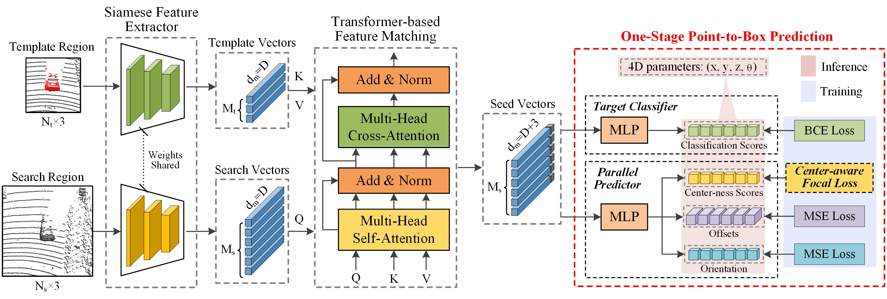

# Official Pytorch Implementation for [IJCAI'23] "OSP2B: One-Stage Point-to-Box Network for 3D Siamese Tracking"

## Introduction

Two-stage point-to-box network acts as a critical role in the recent popular 3D Siamese tracking paradigm, which first generates proposals and then predicts corresponding proposal-wise scores. However, such a network suffers from tedious hyper-parameter tuning and task misalignment, limiting the tracking performance. Towards these concerns, we propose a simple yet effective one-stage point-to-box network for point cloud-based 3D single object tracking. It synchronizes 3D proposal generation and center-ness score prediction by a parallel predictor without tedious hyper-parameters. To guide a task-aligned score ranking of proposals, a center-aware focal loss is proposed to supervise the training of the center-ness branch, which enhances the network's discriminative ability to distinguish proposals of different quality. Besides, we design a binary target classifier to identify target-relevant points. By integrating the derived classification scores with the center-ness scores, the resulting network can effectively suppress interference proposals and further mitigate task misalignment. Finally, we present a novel one-stage Siamese tracker OSP2B equipped with the designed network. Extensive experiments on challenging benchmarks including KITTI and Waymo SOT Dataset show that our OSP2B achieves leading performance with a considerable real-time speed.



## Installation

Create environment and activate

```sh
conda create --name osp2b python=3.7
conda activate osp2b
```

Install pytorch

```sh
conda install pytorch==1.4.0 torchvision==0.5.0 cudatoolkit=10.0 -c pytorch
```

Install requirements

```sh
pip install -r requirements.txt
```

Install dependencies

```sh
python setup.py build_ext --inplace
```

Install OpenPCdet.

```sh
cd OpenPCDet
python setup.py develop
```


## Training and Testing

Train with the KITTI dataset (e.g., for the car class)

```
python train_tracking.py --category_name Car --save_root_dir results/kitti/Cyclist
```

Test with the KITTI dataset (e.g., for the car class)

```
python test_tracking.py --category_name Cyclist --save_root_dir results/kitti/Cyclist
```

Train with the Waymo dataset (e.g., for the vehicle class)

```
python train_tracking_waymo.py --category_name Vehicle --save_root_dir results/waymo/Vehicle
```

Test with the Waymo dataset (e.g., for the vehicle class)

```
python test_tracking_waymo.py --category_name Vehicle --save_root_dir results/waymo/Vehicle
```

## Acknowledge

We acknowledge the excellent implementation from [PTTR](https://github.com/Jasonkks/PTTR) 

